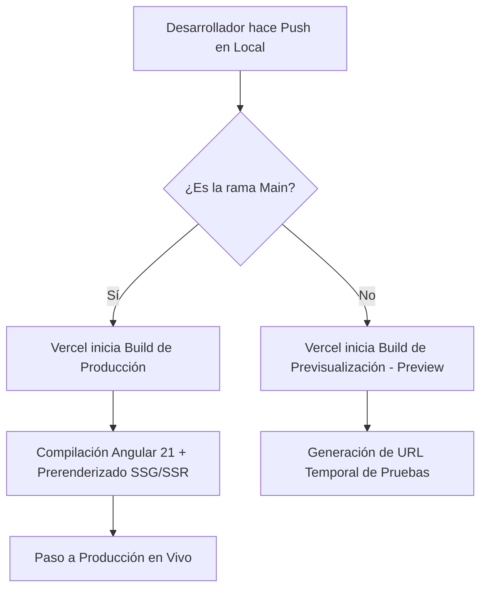
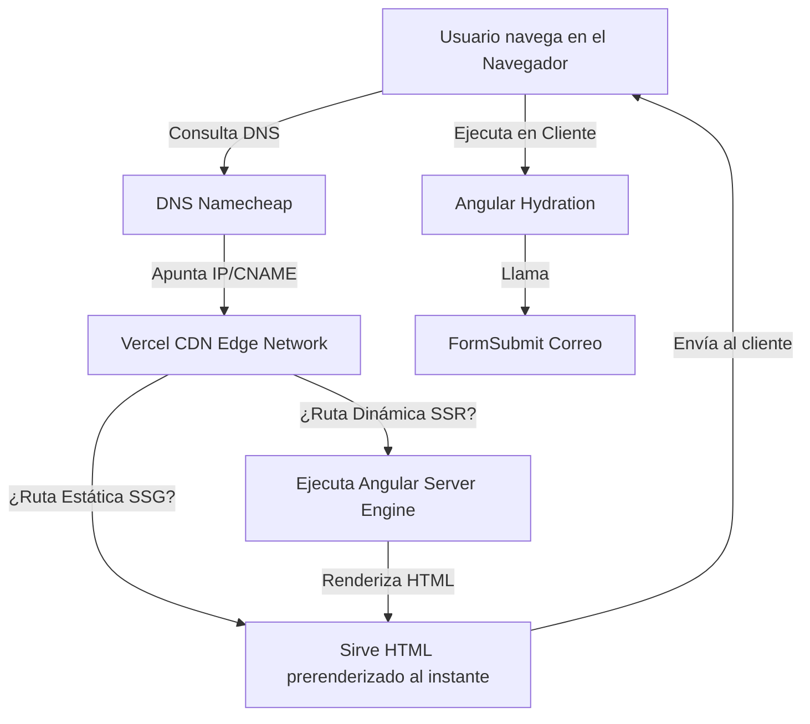

# Documentación de Infraestructura y Despliegue

Este documento detalla la arquitectura de infraestructura, proveedores de hosting, flujo de integración continua (CI/CD), configuraciones DNS y el plan de despliegue y recuperación para el proyecto **Espacio de Escucha**.

---

## 1. Información General

*   **Nombre del Proyecto**: Espacio de Escucha
*   **Nombre Interno**: `psicologia-app`
*   **Estado del Proyecto**: Activo (En Producción)
*   **Fecha de Creación**: Junio 2026
*   **Última Actualización**: Julio 2026
*   **Versión actual**: `1.0.0` (Angular 21 + SSR)

---

## 2. Dominio

*   **Dominio Principal**: `https://espaciodeescuchaonline.com`
*   **URL Alternativa (con www)**: `https://www.espaciodeescuchaonline.com` (redirección configurada automáticamente en Vercel)
*   **Dominio de Desarrollo / Vercel Default**: `https://psicologia-app-nine.vercel.app`
*   **Dominio de Staging**: No configurado actualmente (todos los pushes a ramas secundarias generan URLs de previsualización dinámicas provistas por Vercel).

---

## 3. Hosting

El proyecto se encuentra desplegado en **Vercel** bajo el plan gratuito (**Hobby**).

### Motivo de la Elección
1.  **Soporte Nativo de Angular SSR**: Vercel detecta la arquitectura moderna de Angular 21, resolviendo la compilación híbrida (SSG para rutas fijas y SSR para dinámicas) sin configuraciones complejas de servidores.
2.  **Rendimiento y Red Edge (CDN)**: Sirve los bundles precompilados instantáneamente desde la red CDN global de Vercel, optimizando los Core Web Vitals (FCP, LCP).
3.  **Costo Cero**: Proporciona despliegues ilimitados en su capa gratuita para proyectos personales o de marca personal profesional.
4.  **Integración Directa con GitHub**: Permite disparar despliegues automatizados simplemente haciendo commits.

---

## 4. Configuración en Vercel

*   **Proyecto de Vercel**: `psicologia-app`
*   **Organización / Team**: `COUNCELING TEAM` (Hobby)
*   **Framework Detectado**: `Angular`
*   **Build Command**: `ng build` (automatizado)
*   **Output Directory**: `dist/psicologia-app` (donde se generan el código del cliente y servidor)
*   **Install Command**: `npm install`
*   **Configuración del Dominio**:
    *   `espaciodeescuchaonline.com` (Redirección configurada hacia `www.espaciodeescuchaonline.com` o viceversa de forma nativa).
*   **Configuración SSL**: Certificado SSL administrado y renovado automáticamente por Vercel (Let's Encrypt) sin costo.
*   **Configuración de Caché**: Las páginas estáticas (SSG) se sirven con cabeceras `Cache-Control` inmutables y revalidación en background (Edge Middleware caching).

---

## 5. CI/CD (Integración y Despliegue Continuo)

El flujo de despliegue está 100% automatizado mediante la integración nativa **Vercel - GitHub**:



### Reglas de CI/CD:
*   **Rama de Producción**: `main`
*   **Acción al hacer Push a `main`**: Se compila el build de producción y los cambios se reflejan en el dominio principal en unos 45-60 segundos tras verificar que la compilación no tenga errores.
*   **Acción al hacer Push a otras ramas**: Genera un despliegue de previsualización (Preview Deployment) y una URL única de pruebas para verificar antes de hacer merge.

---

## 6. Configuración de Git

*   **Repositorio**: `cristian-rodrig/psicologia-app`
*   **Proveedor**: GitHub
*   **Branch Principal**: `main`
*   **Convención de Commits**: Se sugiere el uso de Conventional Commits (`feat:`, `fix:`, `docs:`, `refactor:`, `style:`).

---

## 7. Variables de Entorno

Actualmente, el proyecto no requiere secretos de backend ni variables de entorno privadas configuradas en Vercel, ya que toda la inyección de marca y contacto se maneja centralizadamente de forma estática en [`brand.config.ts`](file:///c:/Users/TP412U/Desktop/PSICOLOGIA-APP/src/app/core/config/brand.config.ts).

---

## 8. Servicios Externos e Integraciones

1.  **FormSubmit**: 
    *   *Endpoint*: `https://formsubmit.co/ajax/Inesgomezpdc@gmail.com`
    *   *Propósito*: Permite procesar el formulario de contacto enviando correos reales de forma directa a la casilla de correo sin necesidad de programar un backend.
2.  **Google Fonts**:
    *   *Propósito*: Carga de tipografías premium (`Inter` y `Outfit`). Optimizado con preconexión (`preconnect`) y carga asíncrona (`media="print"`).
3.  **WhatsApp Widget**:
    *   *Propósito*: Canal directo de contacto instantáneo y agendamiento rápido (CTA principal en dispositivos móviles).

---

## 9. Configuración DNS (Namecheap)

La administración DNS se realiza a través de **Namecheap**. Los registros configurados para apuntar la web a los servidores de Vercel son:

| Tipo | Host | Valor / Target | TTL |
| :--- | :--- | :--- | :--- |
| **A** | `@` | `216.198.79.1` | Automatic |
| **CNAME** | `www` | `a85e9e25428e9d5d.vercel-dns-017.com.` | Automatic |

*Nota: Los certificados SSL se renuevan solos automáticamente mediante Vercel.*

---

## 10. Arquitectura de Producción

El flujo de una petición de usuario hasta el renderizado de la aplicación es:



---

## 11. Despliegue Paso a Paso (Para Desarrolladores)

Para realizar una nueva actualización de la web desde cero:

1.  Realizar los cambios en el código local de la aplicación.
2.  *(Opcional pero recomendado)* Verificar que la compilación funcione localmente y no tenga errores de TypeScript:
    ```bash
    npm run build
    ```
3.  Añadir los archivos al commit:
    ```bash
    git add .
    ```
4.  Realizar el commit con un mensaje descriptivo:
    ```bash
    git commit -m "feat: descripción de los cambios"
    ```
5.  Subir los cambios a la rama principal:
    ```bash
    git push origin main
    ```
6.  Vercel detectará el push a `main`, compilará en la nube y actualizará el dominio de forma automática. Puedes ver el estado de la compilación en tiempo real entrando a tu cuenta en [vercel.com](https://vercel.com).

---

## 12. Plan de Recuperación (Rollback)

Si se despliega una versión que causa fallos o bugs en producción:

1.  **Rollback Instantáneo (Vercel Dashboard)**:
    *   Entra en tu panel del proyecto en Vercel.
    *   Haz clic en la pestaña **Deployments** (Despliegues).
    *   Busca el despliegue anterior que funcionaba correctamente.
    *   Haz clic en los tres puntos (`...`) del despliegue y selecciona **"Promote to Production"** (Promocionar a Producción).
    *   *Vercel restablecerá la versión anterior en menos de 5 segundos sin necesidad de recompilar.*
2.  **Rollback desde consola (Git)**:
    *   Si deseas revertir el historial de Git, realiza un revert en tu rama local y vuelve a hacer push:
        ```bash
        git revert HEAD
        git push origin main
        ```

---

## 13. Checklist Pre-Despliegue a Producción

Antes de dar por completado un despliegue, verifica que se cumpla la siguiente lista:

- [ ] **Compilación local sin errores**: La consola debe completar `npm run build` sin fallos de TypeScript ni warnings críticos.
- [ ] **Validación SEO**: Comprobar que los títulos dinámicos y descripciones se inyecten correctamente en cada ruta.
- [ ] **Sitemap actualizado**: El archivo `public/sitemap.xml` debe reflejar la estructura activa del sitio.
- [ ] **Formulario funcional**: El formulario de contacto debe enviar el correo y mostrar el mensaje de confirmación de éxito.
- [ ] **Botones y enlaces**: Asegurar que todos los enlaces (especialmente WhatsApp y reserva de sesión) apunten a las URLs correctas definidas en la configuración.
- [ ] **Certificado SSL válido**: Comprobar que el candado de HTTPS esté activo y sea válido en el dominio `.com`.
