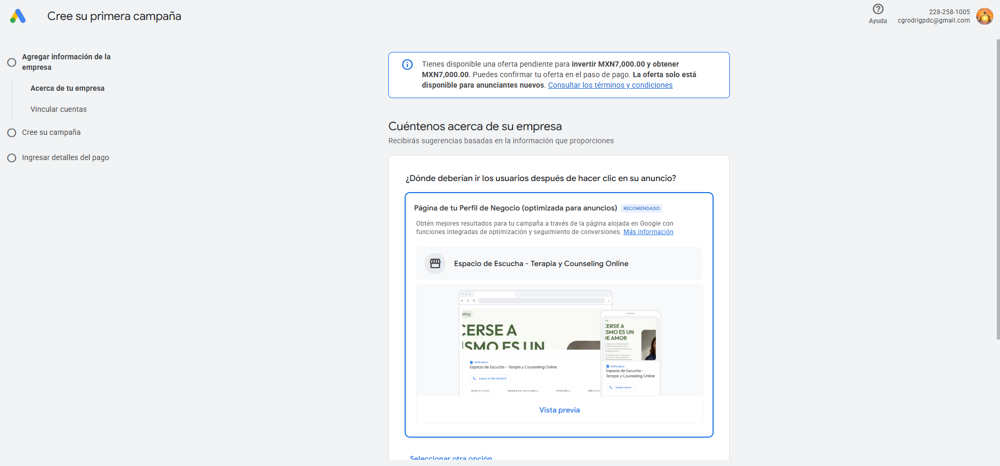

# Estrategia de Producción: PSICOLOGIA-APP

Este documento contiene las recomendaciones estratégicas para el lanzamiento, optimización y escalado de la plataforma Espacio de Escucha, cumpliendo con los requisitos de **Senior SEO, Google Ads Expert y UX Specialist**.

---

## 1. Estrategia de Despliegue (Cloudflare Pages)

Para garantizar un rendimiento de "Élite" y aprovechamiento del SSR:

- **Edge SSR:** Configurar Cloudflare Workers para ejecutar el motor de renderizado de Angular lo más cerca posible del usuario.
- **Cache-Control:** Implementar políticas de caché agresivas para assets estáticos y una política de "stale-while-revalidate" para las páginas SSR.
- **Brotli Compression:** Asegurar que Cloudflare tenga activada la compresión Brotli para minimizar el peso del HTML/JS transferido.

---

## 2. Optimización de Google Ads (CRO)

El sitio ha sido diseñado como una "Máquina de Conversión":

- **Landing Pages de Destino:** Utilizar `/ansiedad-terapia-online`, `/terapia-de-pareja` y `/ayuda-ataques-de-panico` como URLs finales según el grupo de anuncios.
- **Quality Score:** La alta velocidad de carga (LCP < 1.2s) y la relevancia del contenido (keyword density optimizada) garantizan un costo por clic (CPC) más bajo.
- **Event Tracking:** El `AnalyticsService` está preparado para disparar eventos de conversión en:
    - Clic en el botón flotante de WhatsApp.
    - Envío exitoso del formulario de contacto.
    - Clic en el Mobile Sticky CTA Bar.

---

## 3. SEO Local & Google Business Profile

Recomendaciones para dominar los resultados locales en México:

- **NAP Consistency:** Asegurar que el Nombre, Dirección y Teléfono en Google Maps coincidan exactamente con el `brand.config.ts`.
- **Local Schema:** Hemos implementado `Psychologist` y `MedicalWebPage` schema. Se recomienda añadir fotos reales del consultorio (si existe) o de la profesional para aumentar la confianza.
- **Reseñas:** Integrar un carrusel de reseñas reales de Google Maps una vez obtenidas (usando la API de Google Places).

---

## 4. Accesibilidad (WCAG 2.1)

- **Contraste:** Los colores Verde Eucalipto y Azul Pizarra cumplen con el ratio de contraste 4.5:1 para legibilidad.
- **Navegación por Teclado:** Todos los componentes (`Header`, `FAQ`, `Form`) son navegables mediante la tecla TAB.
- **Lectores de Pantalla:** Se han añadido `aria-labels` a los botones de menú y WhatsApp.

---

## 5. Estrategia de Performance (Core Web Vitals)

- **Hydration:** El uso de `provideClientHydration()` evita el parpadeo de la página al cargar.
- **@defer:** Los testimonios y FAQs pesados solo se cargan cuando el usuario hace scroll hacia ellos, ahorrando JS en el primer pintado.
- **Imágenes:** `NgOptimizedImage` gestiona automáticamente los `srcset` y el lazy loading de las fotos secundarias.
